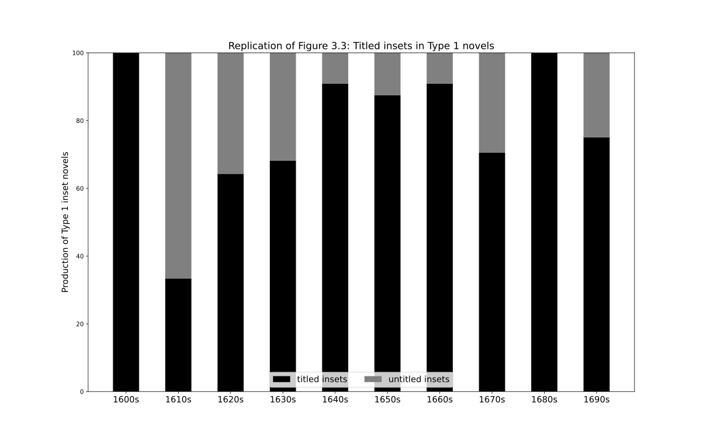
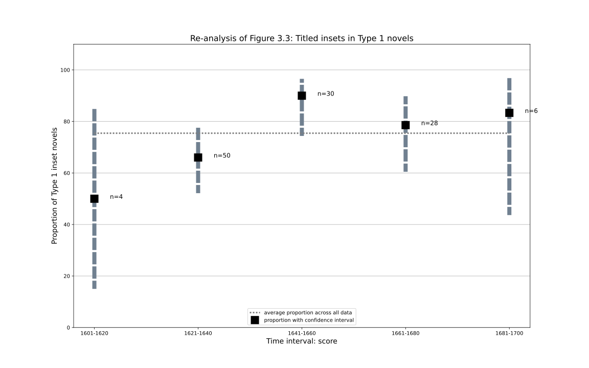
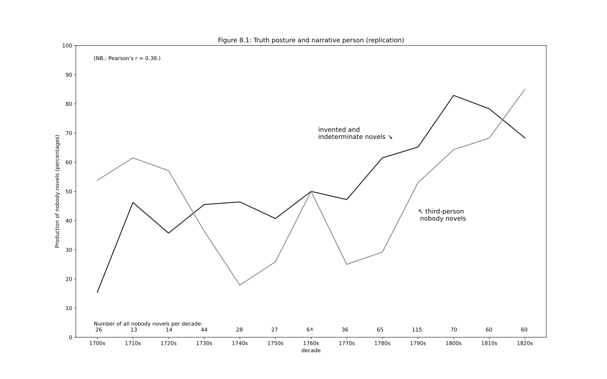

# Replication and re-analysis of _Technologies of the Novel_

This repository contains data, code and graphs that attempt to either replicate analyses provided by Nicholas D. Paige in his book _Technologies of the novel_ (2021), or attempt to re-analyse the data provided by the author (https://doi.org/10.5281/zenodo.3939065) in order to provide a more detailed and/or nuanced look at the data. 

The current page provides a summary of the analysis, with a selection of graphs and some comments. Anyone interested in the finer details is invited to look at the data, code and graphs available in the respective folders (one for each chapter). 

Most analyses are based on the dataset present in the top-level folder, which contains the data provided by Paige for French, but reduced to just those novels that he did not exclude from his analysis, and augmented with some additional columns specifying various time slices, for convenience. 

All graphs as well as the text presented here are licensed with a [Creative Commons Zero](https://creativecommons.org/share-your-work/public-domain/cc0/) licence. This means attribution is not mandatory. However, if you use them and can find a suitable place to attribute the source, please reference this repository as follows: Christof Schöch, "Replication and re-analysis of _Technologies of the Novel_", Github.com, 2022, https://github.com/christofs/paige, DOI: https://doi.org/10.5281/zenodo.6951647.  

## Chapter 3

### Figure 3.3 

Replication of figure 3.3. 

The issue with this graph is that it does not show the uncertainty asscociated with the proportions that are visible. The bar for the 1600s is in fact, as Paige explains in the book, only based on one single datapoint. However, the bar for the 1610s is based only on 3 datapoints, and the bars for the 1680s and 1690s are only based on 2 and 4 datapoints, respectively. The other bars have a bit more data, but there are only 118 novels with type 1 insets in the dataset for the period chosen here. 

Therefore, it may make sense to consider a variant visualization of figure 3.3 that takes these small samples and the uncertainty associated with them into account: 

This variant shows the mean proportion of titled inset novels for each decade (black squares), like Paige's original graph. But it also shows the confidence interval for these values, based on the number of datapoints available to calculate each mean (vertical bars). In addition, the number of datapoints for each decade is also mentioned explicitly (n). Finally, the average value across all decades shown here is displayed as a reference point (horizontal line). 

What becomes clear is that there is so much uncertainty associated with the proportions here, that it is almost impossible to see a trend in the data. The earliest two decades and the latest two decades should really be discounted, leaving us with a bell-shaped development of the means that, however, still shows largely overlapping confidence intervals. What looks like a bell could just as well have been a straight line, by this account. 

It makes sense that when the temporal granularity increases, the confidence intervals get narrower, meaning there is less uncertainty about the data. This is the benefit of using 20-year slices instead of the 10-year slices used above. There is a good likelihood that there is really an increase in titled insets from the period 1621-1640 to the period 1661-1680, followed by a fall in titled insets when going into the period 1681-1700. 

## Chapter 4 

### Figure 4.4 

Replication of figure 4.4: 

Note that there are two additional datapoints in this plot, for the nouvelle of the period 1641-1660. These are not included in Paige's original plot.

The following is an alternative visualisation of the data relevant to figure 4.4:  

This graph shows the same data as the original figure from the book, but does so using boxplots and scattered datapoints, in order to better show (a) the number of datapoints each median value is based on, and (b) the spread and considerable overlap of the datapoints. This is a way of better keeping the uncertainty and limitations of the data visible in the graph and avoids projecting more certainty than there really is in the data. (Four datapoints of novels with more than 1 million words have been removed from the plot for better readability. This removal strongly affects the barplot for the histoires of 1641-1660, in particular, as there are only very few datapoints.) 

There appears to be a clear increase of median novel length for both unsubtitled novels and histoires, between the period 1621-1640 and 1641-1660, especially in the original lineplot. If that's not a peak, what is, one may ask. However, checking for the statistical difference between the two distributions of lengths, for each type of novel between these two time periods, shows rather high p-values (calculated on all novels, including the ones removed from the plot): 0.059 for histoires and 0.039 for unsubtitled novels. This means that the overlap between the two distributions is so large, and the size of the sample so limited, that this difference do not in fact suggest a true difference in the means. There's a good chance that there is no peak at all!   

### Figure 4.7 

Replication of figure 4.7: 

This plot is not really problematic. The one thing that is important to note is that the data is plotted as a percentage of all real-world novels. This obscures the low number of datapoints that is the basis of the plot. For example, the movement of the "nouvelle galante" is 4%, 17%, 10.5%, 22%, 4.5% for the period from the 1670s to the 1710s. However, in terms of raw counts, these percentages only correspond to 3, 6, 8, 7, 1 such nouvelles, making the movement or development we see here rather sensitive to a bias from the sampling procedure. (Note that there is no exact correspondence between percentages and counts here, because the count of other types of novels varies for each decade.)

## Chapter 8 

### Figure 8.1

The following is a replication of the plot, with some added information. It shows two groups of novels: those with a a truth posture that is either invented or indeterminate, and those which are written in the third person. 

The plot tracks perfectly with the original plot, so the data selected for each line appears to be correct. 

Two pieces of information have been added: the number of nobody novels for each decade and the Pearson's correlation coefficient between the counts of the two types of novels. Note that at r = 0.38, the correlation is moderately positive. Paige may or may not have quantified this correlation; he describes it as "while not perfect, [it] is detectible" (p. 138). 

However, note that the way the two groups of novels are defined, there is quite a bit of potential for overlap between them, and in a sense, the correlation simply quantifies this degree of overlap. That is of course part of Paige's point. (The fact that the percentages for the two kinds of novels add up to more than 100%, at least starting in the 1790s, shows that there must be overlap. From this fact alone, we can expect some degree of correlation.) 

Just for the sake of argument, it is of course possible to focus on those novels alone that do not overlap, focusing on novels with an invented or indeterminate thruth posture that are not in the third person, and all novels in the third person that have neither an invented and indeterminate truth posture. The figure below shows the result: 

Now, any correlation has disappeared; Person's r is strongly negative (at -0.8) and this is also very clear from the way the lines move in opposite directions at almost every step of the way. 

### Figure 8.2

This one can be replicated easily. 

However, the complexity of the situation is again obscured by only showing the means in a lineplot, rather than showing the distribution of novel lengths in each decade. This is shown in the following figure: 

Here, the considerable range of the novel lengths and the overlap of typical values between each decade becomes clearly visible. That is not to say there isn't a real trend, but it adds considerable nuance to the lineplot. In fact, when testing for a statistical difference of the means of the length distribution for the 1770s vs. that for the 1820s, the Kolmogorov-Smirnov-test indicates a p-value of 0.012, confirming that there is indeed a significant increase of novels lengths in words over the period. 

### Figure 8.3

## Annex

### Figure A.2

In the book, figure A.2 is actually a table that contains more information than just the number of novels per decade, but also information on which years where sampled from and the error rate associated with the sample from each decade. 

The above figure shows the number of novels per decade. 

The above figure shows the number of novels per year. The downside of the sampling procedure becomes clearly visible: in decades with a large novel production, only a small number of years are used to draw novels from; from these few years, however, a lot of novels are selected! 

