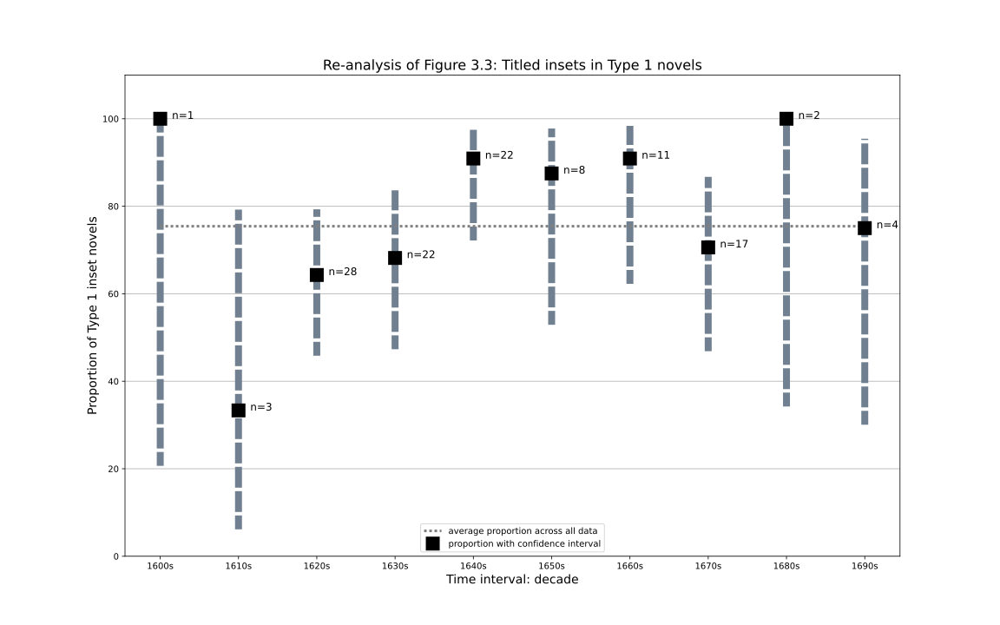
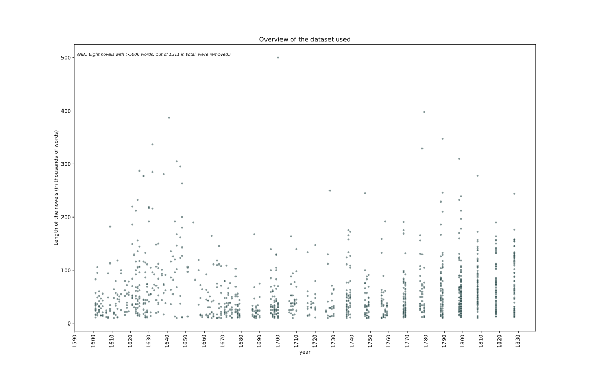

# Replication and re-analysis of _Technologies of the Novel_

This repository contains data, code and graphs that attempt to either replicate analyses provided by Nicholas D. Paige in his book _Technologies of the novel_ (2021), or attempt to re-analyse the data provided by the author (https://doi.org/10.5281/zenodo.3939065) in order to provide a more detailed and/or nuanced look at the data. 

The current page provides a summary of the analysis, with a selection of graphs and some comments. Anyone interested in the finer details is invited to look at the data, code and graphs available in the respective folders (one for each graph analysed). 

Most analyses are based on the dataset present in the top-level folder, which contains the data provided by Paige for French, but reduced to just those novels that he did not exclude from his analysis, and augmented with some additional columns specifying various time slices, for convenience. 

All graphs as well as the text presented here are licensed with a [Creative Commons Zero](https://creativecommons.org/share-your-work/public-domain/cc0/) licence. This means attribution is not mandatory. However, if you use them and can find a suitable place to attribute the source, please reference this repository as follows: Christof Schöch, "Replication and re-analysis of _Technologies of the Novel_", Github.com, 2022, https://github.com/christofs/paige, DOI: https://doi.org/10.5281/zenodo.6951647.  

## Chapter 3

### Figure 3.3 

Replication of figure 3.3. 

A variant visualization of figure 3.3: 

This variant shows the mean values for each decade (squares), like Paige's original graph. In addition, it shows the confidence interval for these values, based on the number of datapoints available to calculate each mean (vertical bars). In addition, the number of datapoints for each decade is also mentioned explicitly (n). Finally, the average value across all decades shown here is displayed as a reference point (horizontal line). 

## Chapter 4 

### Figure 4.4 

Replication of figure 4.4: 

Note that there are two additional datapoints in this plot, for the nouvelle of the period 1641-1660. These are not included in Paige's original plot.

The following is an alternative visualisation of the data relevant to figure 4.4:  

This graph shows the same data as the original figure from the book, but does so using boxplots and scattered datapoints, in order to better show (a) the number of datapoints each median value is based on, and (b) the spread and considerable overlap of the datapoints. This is a way of better keeping the uncertainty and limitations of the data visible in the graph and avoids projecting more certainty than there really is in the data. 

### Figure 4.7 

Replication of figure 4.7: 

This plot is not really problematic. The one thing that is important to note is that the data is plotted as a percentage of all real-world novels. This obscures the low number of datapoints that is the basis of the plot. For example, the movement of the "nouvelle galante" is 4%, 17%, 10.5%, 22%, 4.5% for the period from the 1670s to the 1710s. However, in terms of raw counts, these percentages only correspond to 3, 6, 8, 7, 1 such nouvelles, making the movement or development we see here rather sensitive to a bias from the sampling procedure. (Note that there is no exact correspondence between percentages and counts here, because the count of other types of novels varies for each decade.)

## Annex

### Figure A.2

The above figure shows the number of novels per decade. 

The above figure shows the number of novels per year. The downside of the sampling procedure becomes clearly visible: in decades with a large novel production, only a small number of years are used to draw novels from. 

